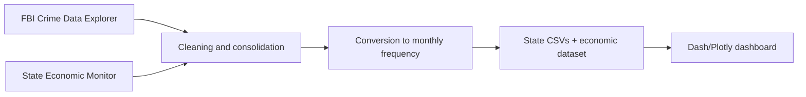

# US crime and economic dashboard

[Português](README.md) | [English](README.en.md)

Interactive dashboard for exploring crime and economic indicators across US states from **January 2019 to December 2023**. The project transforms heterogeneous data into a visual experience with maps, time series, state comparisons and economic context.

## Problem and objectives

Crime and economic statistics are published with different structures and frequencies, making joint analysis difficult. This project supports four exploratory tasks:

- compare crime levels between states and over time;
- identify the most frequently reported offences in a selected state;
- relate crime trends to normalised economic indicators;
- compare up to three states over the same period and crime selection.

The dashboard supports exploratory analysis; temporal associations in the visualisations do not establish causality.

## Features

- animated monthly US choropleth map;
- robust colour scale based on the interquartile range;
- selection and search across dozens of crime categories;
- state detail with national-average comparison;
- time series and ranking of the most reported offences;
- Z-score heatmap for economic indicators;
- simultaneous comparison of up to three states;
- information page with context, sources and usage guidance.

## Data pipeline



The original work processed 3,672 crime files into 51 consolidated files (50 states and the District of Columbia). Economic series with different frequencies were aligned monthly; quarterly and irregular values were distributed or interpolated according to the type of indicator. The repository includes the consolidated CSV files used by the application.

The report identifies two main sources:

- **FBI Crime Data Explorer**, for reported offences;
- **Urban Institute — State Economic Monitor**, for employment, earnings, housing and state GDP.

## Technology stack

- Python;
- Dash;
- Plotly;
- pandas and NumPy;
- declarative HTML/CSS through Dash components.

## Repository structure

```text
EUA_Crime_Economic_Analysis/
├── Dataset/
│   ├── Crime_by_state/       # monthly series per state
│   └── economic_all_data/    # economic indicators and dictionaries
├── projeto_python.py         # Dash application
├── cleanEconomic.py          # economic-data preparation
├── VAD_Final_Report.pdf      # design, methodology and evaluation
├── requirements.txt
├── README.md
└── README.en.md
```

## Run locally

```bash
git clone https://github.com/josepedrocunhazzz/EUA_Crime_Economic_Dashboard.git
cd EUA_Crime_Economic_Dashboard
python3 -m venv .venv
source .venv/bin/activate
python -m pip install --upgrade pip
python -m pip install -r requirements.txt
```

Before starting, open `projeto_python.py` and replace the absolute paths near the top of the file:

- `data_dir` → `Dataset/Crime_by_state`;
- `economic_dir` → `Dataset/economic_all_data`;
- `economic_file_path` → `Dataset/economic_all_data/ecom_data.csv`;
- `debug_file_path` → a writable local file such as `debug.txt`.

Then run:

```bash
python projeto_python.py
```

Open the local URL shown by Dash, normally [http://127.0.0.1:8050](http://127.0.0.1:8050).

## Visual-design decisions

The map is the spatial entry point; tooltips and detail charts move from a national view to a selected state. Z-score normalisation makes economic indicators with different scales comparable, while limiting comparison to three states keeps charts readable. The report also documents design iterations and user testing.

## Academic context

Project presented in **José Cunha's** portfolio and developed for the Advanced Data Visualisation course. Full academic authorship, rationale, prototypes, data processing and discussion are recorded in the [final report](VAD_Final_Report.pdf).
