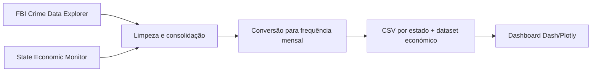

# Dashboard de criminalidade e economia dos EUA

[Português](README.md) | [English](README.en.md)

Dashboard interativo para explorar a evolução da criminalidade e de indicadores económicos nos estados dos EUA entre **janeiro de 2019 e dezembro de 2023**. O projeto transforma dados heterogéneos numa experiência visual com mapas, séries temporais, comparação entre estados e contexto económico.

## Problema e objetivos

As estatísticas criminais e económicas são publicadas com estruturas e frequências diferentes, o que dificulta a sua análise conjunta. Este trabalho procura tornar essas relações exploráveis através de quatro tarefas:

- comparar níveis de criminalidade entre estados e ao longo do tempo;
- identificar os crimes com maior incidência num estado selecionado;
- relacionar tendências criminais com indicadores económicos normalizados;
- comparar até três estados no mesmo período e conjunto de crimes.

O dashboard apoia análise exploratória; as visualizações mostram associação temporal e não demonstram causalidade.

## Funcionalidades

- mapa coroplético dos EUA com animação mensal;
- escala de cor robusta baseada no intervalo interquartil;
- seleção e pesquisa de dezenas de categorias de crime;
- detalhe por estado e comparação com a média nacional;
- séries temporais e ranking dos crimes mais reportados;
- heatmap de indicadores económicos em Z-score;
- comparação simultânea de até três estados;
- página informativa com contexto, fontes e instruções de utilização.

## Pipeline de dados



O trabalho original processou 3 672 ficheiros criminais em 51 ficheiros consolidados (50 estados e District of Columbia). Dados económicos com frequências diferentes foram alinhados mensalmente; valores trimestrais/irregulares foram distribuídos ou interpolados conforme a natureza da variável. O repositório inclui os CSV consolidados usados pela aplicação.

Principais fontes descritas no relatório:

- **FBI Crime Data Explorer**, para ocorrências reportadas;
- **Urban Institute — State Economic Monitor**, para emprego, rendimentos, habitação e PIB estadual.

## Tecnologias

- Python;
- Dash;
- Plotly;
- pandas e NumPy;
- HTML/CSS declarativo através dos componentes Dash.

## Estrutura

```text
EUA_Crime_Economic_Analysis/
├── Dataset/
│   ├── Crime_by_state/       # séries mensais por estado
│   └── economic_all_data/    # indicadores económicos e dicionários
├── projeto_python.py         # aplicação Dash
├── cleanEconomic.py          # preparação dos dados económicos
├── VAD_Final_Report.pdf      # design, metodologia e avaliação
├── requirements.txt
├── README.md
└── README.en.md
```

## Executar localmente

```bash
git clone https://github.com/josepedrocunhazzz/EUA_Crime_Economic_Dashboard.git
cd EUA_Crime_Economic_Dashboard
python3 -m venv .venv
source .venv/bin/activate
python -m pip install --upgrade pip
python -m pip install -r requirements.txt
```

Antes de iniciar, abrir `projeto_python.py` e substituir os caminhos absolutos definidos no início do ficheiro:

- `data_dir` → `Dataset/Crime_by_state`;
- `economic_dir` → `Dataset/economic_all_data`;
- `economic_file_path` → `Dataset/economic_all_data/ecom_data.csv`;
- `debug_file_path` → um ficheiro local gravável, por exemplo `debug.txt`.

Depois executar:

```bash
python projeto_python.py
```

Abrir o endereço local apresentado pelo Dash, normalmente [http://127.0.0.1:8050](http://127.0.0.1:8050).

## Decisões de visualização

O mapa serve como ponto de entrada espacial; os tooltips e gráficos de detalhe permitem passar de uma visão nacional para um estado. A normalização económica por Z-score torna indicadores de escalas diferentes comparáveis, enquanto a limitação a três estados evita sobrecarregar os gráficos. O relatório documenta ainda iterações de design e testes com utilizadores.

## Contexto académico

Projeto desenvolvido por **José Cunha e Marta Antunes** para a unidade curricular de Visualização Avançada de Dados. Consultar o [relatório final](VAD_Final_Report.pdf) para a fundamentação, protótipos, processamento dos dados e discussão completa.
